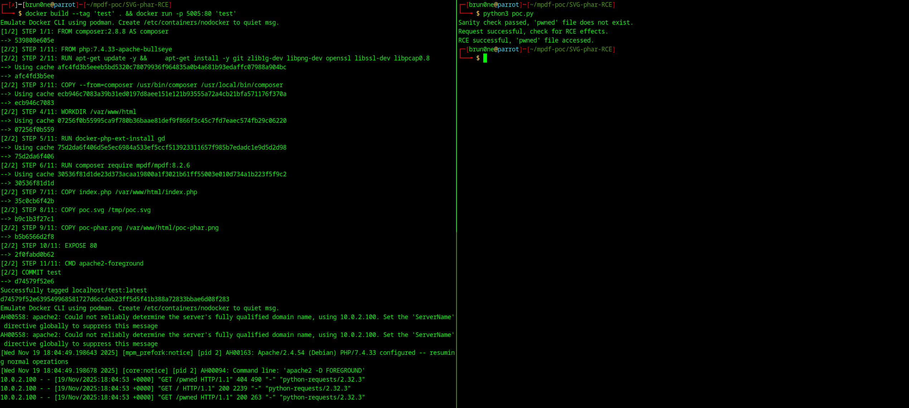

# How to run

It requires Python to be installed.

1. Run the vulnerable target:

```sh
$ docker build --tag 'test' . && docker run -p 5005:80 'test'
# vulnerable app exposed on port 5005
```

2. Execute the PoC:

```sh
$ python3 poc.py
```

# Expected output


