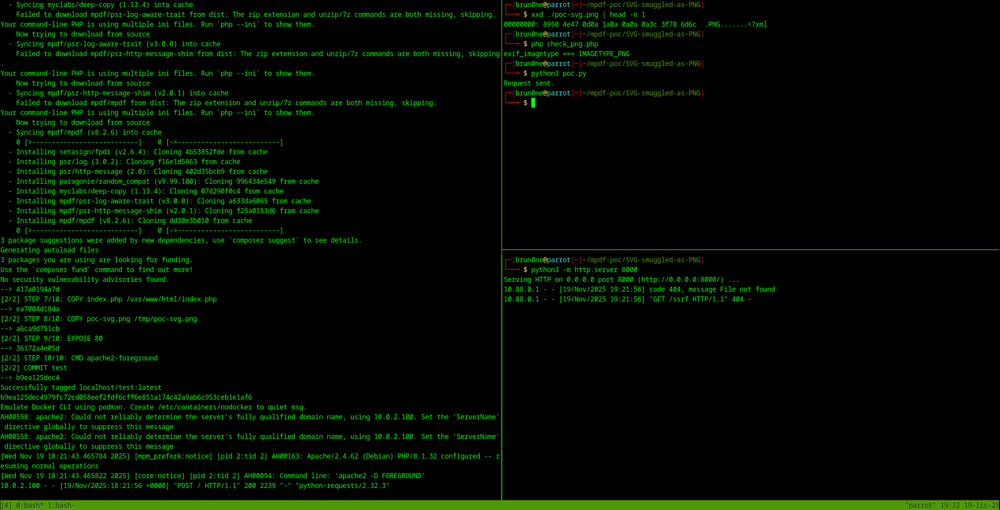

# How to run

It requires Python to be installed.

1. Run the vulnerable target:

```sh
$ docker build --tag 'test' . && docker run -p 5005:80 'test'
# vulnerable app exposed on port 5005
```

2. Replace the IP address in [poc-svg.png](./poc-svg.png) and make sure the magic bytes at the beginning did not change.

The IP has to be the attacker's IP address reachable from inside the container (the host machine in the Docker network).

3. Start a simple web server in the on the attacker machine (the host):

```sh
$ python3 -m http.server 8000
```

4. Execute the PoC:

```sh
$ python3 poc.py
```

# Expected output


